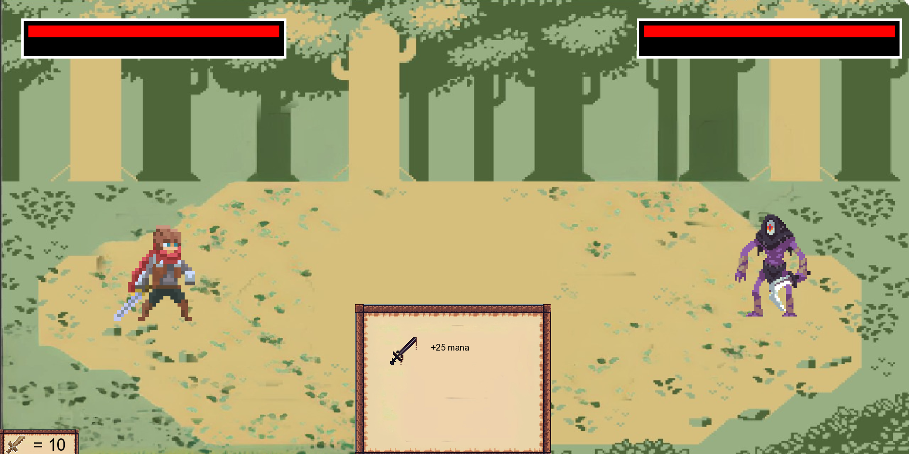

# Welcome to our project !

This is one of the most important project we have as first year student at Epitech.
Create our own RPG !

### Description of the game

You are the newly invoked hero from the Earth and you have to save this isekai invaded
by the demon king and his army !

* Use arrow key to move around
* Keep fighting enemy to get stronger and gain reward
* Use your brain to fight enemy with differents skills
* Use differents items to help yourself during this quest

Here is picture of our battle system :

### Libray allow to accomplish this project

* All functions from standard lib C
* All functions from math lib
* All functions from CSFML lib